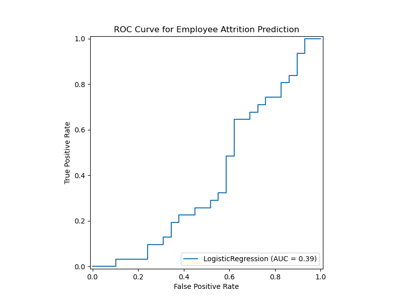

# 📊 Employee Attrition Prediction using Logistic Regression

## 🔹 Objective
The goal of this project is to build a predictive model to help the HR department identify employees at **high risk of leaving the company**. This will allow HR to take proactive steps to improve employee retention.

---

## 📂 Dataset
- **File**: `employee_attrition.csv`  
- **Columns**:
  - `age`
  - `years_at_company`
  - `job_level`
  - `salary`
  - `num_projects`
  - `left_company` (Target: `1` = Left, `0` = Stayed)

---

## 🛠️ Methodology

### 1. Data Preparation
- Loaded the dataset `employee_attrition.csv`.
- Target variable: **`left_company`**.

### 2. Preprocessing
- Train/Test split: **70/30**.
- Features were standardized using **StandardScaler** to improve model performance.

### 3. Model
- Applied **Logistic Regression** for binary classification.  
- Logistic Regression outputs probabilities (via the **sigmoid function**) that an employee will leave.

### 4. Evaluation Metrics
The model’s performance was evaluated using standard classification metrics:

- **Accuracy**: `0.5667`  
- **Precision**: `0.5769`  
- **Recall**: `0.8824`  
- **F1-Score**: `0.6977`  
- **ROC-AUC Score**: `0.5113`

📈 A **ROC Curve** was plotted to visualize the trade-off between True Positive Rate (Recall) and False Positive Rate.

---

## 📊 Results & Insights

1. **Model Performance**
   - The ROC-AUC score of **0.51** suggests that the model performed only slightly better than random guessing.  
   - However, feature analysis provided valuable HR insights.

2. **Key Factors Influencing Attrition**
   - **Years at company**: Strong negative predictor → longer tenure reduces attrition risk.  
   - **Number of projects**: Strong negative predictor → employees engaged in more projects are less likely to leave.  
   - **Job level**: Positive correlation → higher-level employees showed higher attrition risk.  
   - **Salary & Age**: Not significant predictors in this dataset.  

---

## 📝 Recommendations for HR

- **Retention focus on new employees**: Provide mentorship and engagement activities during early tenure.  
- **Project involvement**: Encourage participation in meaningful projects to increase engagement.  
- **Investigate senior-level attrition**: Understand why higher-level employees are leaving (e.g., workload, career growth, recognition).  
- **Less emphasis on salary/age**: Since these were not strong predictors, HR should prioritize other engagement strategies.

---

## 📌 Next Steps
- Experiment with advanced models (Random Forest, XGBoost) for better predictive power.  
- Perform feature engineering (e.g., work-life balance, promotions, overtime hours).  
- Address class imbalance if present (SMOTE, class weights).  

---

## 📷 Visualizations

### 🔹 ROC Curve

---

## ⚙️ Tech Stack
- **Language**: Python  
- **Libraries**: `pandas`, `numpy`, `scikit-learn`, `matplotlib`, `seaborn`

---

## 👨‍💻 Author
Developed for HR Analytics Project — *Employee Attrition Prediction using Logistic Regression*
